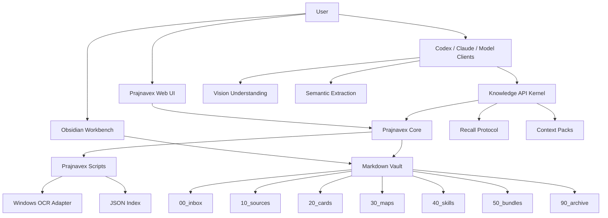
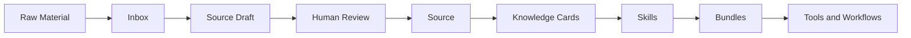
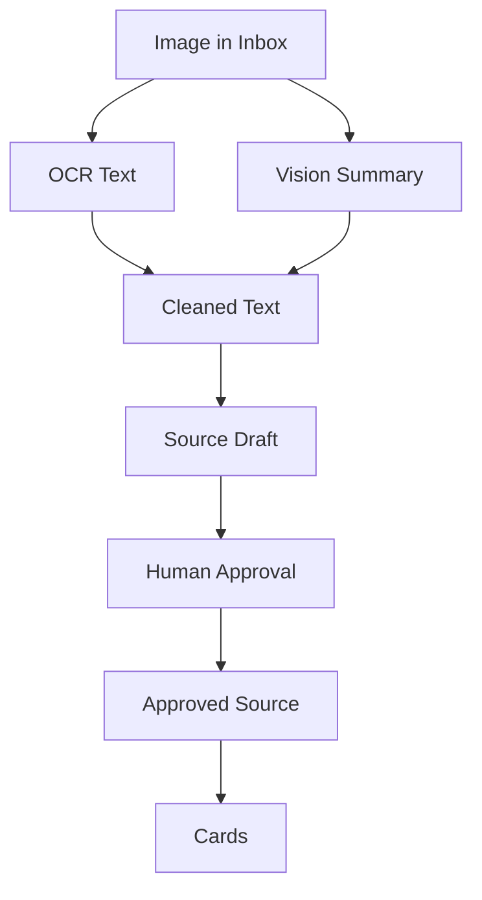
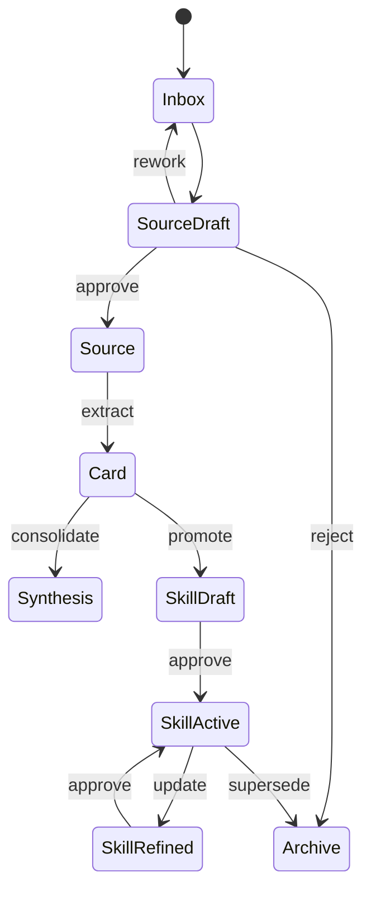

# Prajnavex Architecture Overview

Prajnavex | 般若维 is a local-first, model-neutral knowledge core for turning messy reading material into structured sources, cards, synthesis, skills, reusable workflows, and context packs.

Subtitle: A structured knowledge base for clear seeing.

中文副标题：以般若照见，以结构成维

## System Map



## Knowledge Pipeline



The pipeline separates capture from commitment. Inputs can be messy, but approved knowledge must be structured.

## Image Ingest



OCR is evidence. Vision Summary is semantic structure. Cleaned Text is the reviewed synthesis used for source and card creation.

## Component Boundaries

| Component | Responsibility |
| --- | --- |
| Prajnavex Core | Own the schema, lifecycle, validation, index, API contracts, and recall behavior. |
| Obsidian | Human workbench for reading, editing, linking, judgment, approval, and review. |
| Prajnavex Web UI | Operational client for inbox, drafts, sources, cards, skills, and approval flows. |
| Knowledge API Kernel | Stable local interface for ingestion, retrieval, review, and context-pack export. |
| Scripts | OCR, source draft creation, approval, indexing, and validation. |
| Codex / Claude / model clients | Semantic extraction, vision understanding, card synthesis, retrieval, and skill evolution proposals through stable interfaces. |
| GitHub | Public project showcase and version control. |

## Current MVP

- Markdown vault with structured folders.
- Source, card, skill, and bundle templates.
- OCR-backed image source draft workflow.
- Vision-first image ingest rules.
- Human approval before source indexing.
- Local Web UI and Windows desktop launcher.
- GitHub release tag `v0.1.0`.

## Knowledge Object Lifecycle



The default rule is automation proposes, humans approve.

## Recall And Reuse Direction

The v0.4+ direction keeps the physical vault layout stable while adding a
model-neutral recall and reuse layer:

```text
surface -> trigger -> load
```

- `surface`: lightweight titles, summaries, tags, stages, and review metadata.
- `trigger`: candidate notes selected by task, tag, scenario, or query.
- `load`: full note bodies, evidence, Skills, or Bundles pulled only when
  needed.

Reusable outputs should be exported as bounded context packs rather than raw
folder reads:

- Source evidence packs.
- Card context packs.
- Skill execution packs.
- Bundle workflow packs.
