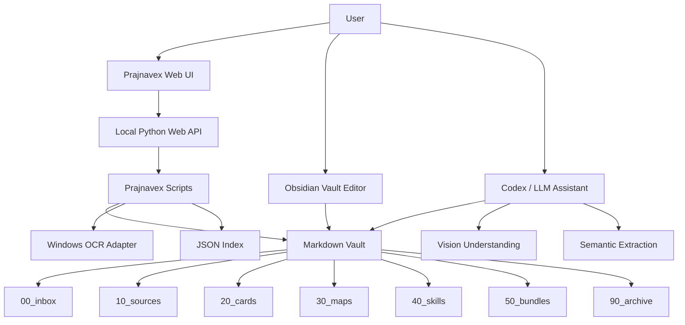
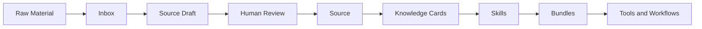
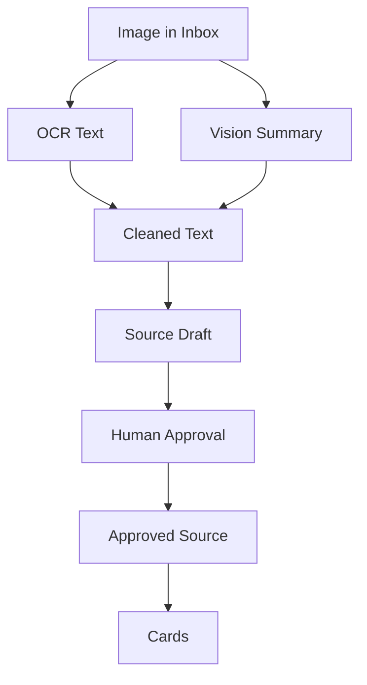
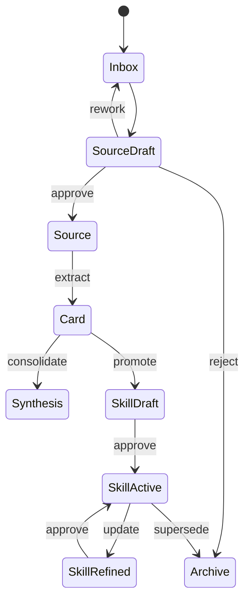

# Prajnavex Architecture Overview

Prajnavex | 般若维 is a local-first knowledge system for turning messy reading material into structured sources, cards, synthesis, skills, and reusable workflows.

Subtitle: A structured knowledge base for clear seeing.

中文副标题：以般若照见，以结构成维

## System Map

## Knowledge Pipeline

The pipeline separates capture from commitment. Inputs can be messy, but approved knowledge must be structured.

## Image Ingest

OCR is evidence. Vision Summary is semantic structure. Cleaned Text is the reviewed synthesis used for source and card creation.

## Component Boundaries

| Component | Responsibility |
| --- | --- |
| Obsidian | Read, edit, and manually review Markdown vault content. |
| Prajnavex Web UI | Browse inbox, drafts, sources, cards, and skills. |
| Python API | Serve local UI and call project scripts. |
| Scripts | OCR, source draft creation, approval, indexing, and validation. |
| Codex / LLM | High-quality semantic extraction, vision understanding, card synthesis, and skill evolution proposals. |
| GitHub | Public project showcase and version control. |

## Current MVP

- Markdown vault with structured folders.
- Source, card, skill, and bundle templates.
- OCR-backed image source draft workflow.
- Vision-first image ingest rules.
- Human approval before source indexing.
- Local Web UI and Windows desktop launcher.
- GitHub release tag `v0.1.0`.

## Knowledge Object Lifecycle

The default rule is automation proposes, humans approve.
